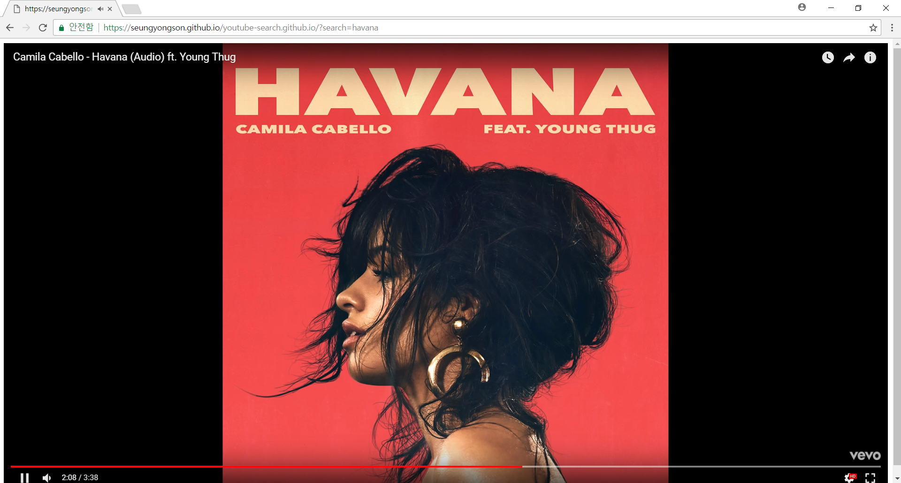

# youtube-search.github.io

정말로 심플한 유튜브 검색과 동시에 영상이 틀어지는 검색기 이다.  
유튜브에서 같은 노래를 무한반복으로 듣고 싶을 때 정말 사용하기 좋다.

## 해결중인 문제
현재 검색어 결과를 보여주는 웹페이지를 긁어오는 과정에서 Cross Domain 문제가 발생하고 있다.  
Cross Domain 문제를 해결하거나 YouTube Data API (v3)를 통해 검색결과를 가져오는 방법을 쓸 예정이다.

## 문제 해결하기 전까지 사용법  

1. 크롬 바로가기를 하나 만든다.  
2. 만든 바로가기에 속성에 들어가서 대상에 --disable-web-security --user-data-dir="C:\chrome 추가한다.  
3. --disable-web-security --user-data-dir="C:\chrome 를 추가한 바로가기를 통해 크롬에 들어간다.  
ex) 대상이 C:\Program Files (x86)\Google\Chrome\Application\chrome.exe" 이면  
C:\Program Files (x86)\Google\Chrome\Application\chrome.exe" --disable-web-security --user-data-dir="C:\chrome"  
이렇게 내용을 바꾸면된다.  
4. https://seungyongson.github.io/youtube-search.github.io/?search=원하는검색어 url을 적고 사이트에 들어간다.
5. 그러면 검색어에 가장 가까운 유튜브 영상에 틀어진다.

# + 내용 추가 
